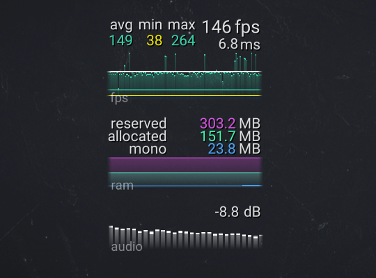

# In Game FPS Counter

A frame rate sensitive game, such as a VR game must maintain a consistent high frame rate or it can induce nausea. You must create an on screen frame counter during development to show areas of the game where the frame rate drops. The counter needs to be enabled only in development build version and must not appear in final builds. The value should be averaged over the last second so it doesn't jump around too fast to be visible.

You must include the following in your Unity package:

1. the required script
2. any required prefabs
3. a scene to demonstrate the counter
4. documentation for this component

## Extra Credit

For extra credit on this brief: include an on screen graph showing the historical average frame rate of the last few seconds; show the frame rate in miliseconds per frame as well as frames per second; keep a record of 1% or 0.1% lows.
