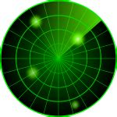

# Radar

Create an onboard radar system for a game to track the relative direction and distance to the player of other game objects. Directly up on the radar screen should represent the forward direction of the player's object. The package must include a `RadarContact` script. Any Unity transform with the `RadarContact` script attached should show up on the radar screen.

You must include the following in your Unity package:

1. the required scripts
2. a scene demonstrating the component
3. documentation for this component

## Extra credit

If objects are out of range of the radar, mark them out as out of range, but continue to show their position relative to the player on the outer edge of the radar map.